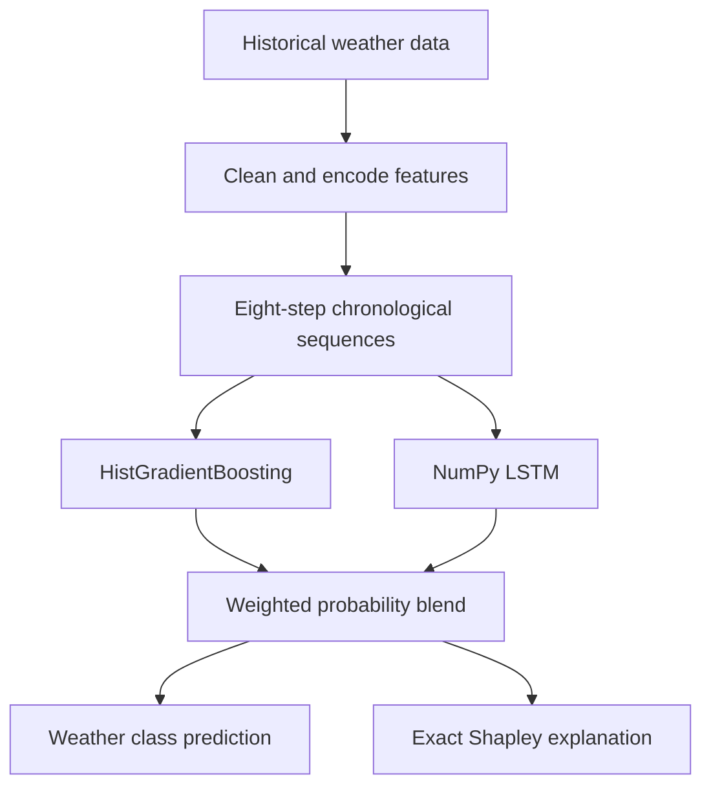

# Hybrid Explainable Indian Weather Classifier

## Live Demo

[Launch the Weather Prediction App](https://explainable-hybrid-weather-prediction.onrender.com)

This version combines a HistGradientBoosting classifier with a genuine LSTM implemented in NumPy. Both models consume chronological sequences; their probability outputs are blended. Predictions use OpenWeather five-day forecast sequences and exact interventional Shapley values over all 2^11 feature coalitions.

## Key features

- Hybrid ensemble combining gradient boosting and a recurrent neural network
- Chronological eight-step weather sequences grouped by location
- Time-aware train, validation, and holdout splits to reduce temporal leakage
- Exact local Shapley explanations for each predicted weather class
- Live five-day forecast inputs from OpenWeather
- Flask interface, automated tests, Docker packaging, and Render deployment

## Screenshots

### Landing page


### Forecast input


### Prediction result


### SHAP explanation


## Architecture



At inference time, the application retrieves forecast observations for the selected Indian location, applies the saved encoders and scaler, and sends the resulting sequence to both models. Their class probabilities are blended using a validation-selected weight.

## Technology stack

- **Modeling:** Python, NumPy, pandas, scikit-learn
- **Deep learning:** custom LSTM implementation in NumPy
- **Explainability:** exact interventional Shapley-value computation
- **Application:** Flask, HTML, CSS, JavaScript
- **Delivery:** GitHub Actions, Docker, Gunicorn, Render

## Data and preprocessing

The included `dataset/IndianWeatherRepository.csv` contains historical observations from Indian locations. Training derives calendar features from timestamps, groups detailed conditions into broader weather classes, ordinal-encodes location and region, standardizes numerical features, and constructs rolling eight-observation sequences independently for each location. Encoders and scalers are fitted only on the training period.

The 11 model features are year, month, day, location, region, temperature, precipitation, humidity, cloud cover, pressure, and wind speed.

## Setup

```bash
python -m venv .venv
source .venv/bin/activate  # Windows: .venv\\Scripts\\activate
pip install -r requirements.txt
python train_hybrid.py     # only needed when retraining
export OPENWEATHER_API_KEY="your-key"  # Windows PowerShell: $env:OPENWEATHER_API_KEY="your-key"
python main.py
```

Open `http://127.0.0.1:2000`.

Runtime artifacts are `hybrid_bundle.joblib` and `lstm_model.npz`. See `evaluation.json` for time-aware holdout results.

The serialized bundle requires the pinned scikit-learn version in
`requirements.txt`. Scikit-learn model files are not guaranteed to load across
different library versions.

## Verified results

| Model | Accuracy | Macro F1 |
|---|---:|---:|
| Gradient boosting | 93.43% | 63.34% |
| LSTM | 84.48% | 44.48% |
| Hybrid | 93.38% | 63.27% |

The later chronological holdout contains 18,992 sequences. The hybrid is genuine, but it does not outperform gradient boosting alone on this test period.

See [`evaluation.json`](evaluation.json) for the saved metrics and [`MODEL_CARD.md`](MODEL_CARD.md) for intended use, evaluation details, and limitations.

## Tests

```bash
python -m unittest discover -s tests -v
python verify_project.py
```

The tests check probability normalization, deterministic LSTM serialization, and exact Shapley additivity.
They also verify that weather-service authentication errors never expose API keys.

## Docker

```bash
docker build -t explainable-weather .
docker run --rm -p 2000:2000 -e OPENWEATHER_API_KEY="your-key" explainable-weather
```

## Scope

This is a short-term weather-condition classifier and explainability demonstration. It is not a climate-change simulator or a safety-critical forecasting service. See `MODEL_CARD.md` for intended use, evaluation details, and limitations.
